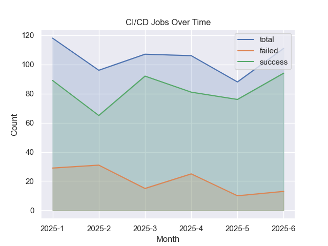

# gitlab-jobstats

Query statistics for GitLab CI/CD jobs

# How is this different from `https://gitlab.cnh.com/${PROJECT}/-/pipelines/charts`?

Jobstats was designed with the goal of identifying and fixing flaky CI jobs.

* jobstats can filter by branch
* jobstats can filter by job name
* jobstats looks at jobs, and includes retried jobs, while GitLab's stats look at pipelines (you can
  rerun jobs to make a failing pipeline pass)

# Download from the GitLab API

```shell
./jobstats.py \
    --token-file ~/.gitlab-pat.txt \
    --domain gitlab.com \
    --branch master \
    --since 2025-01-01 \
    my-group/my-project \
    data/my-project-2025.csv
```

This will generate a CSV of jobs for all pipelines on the specified branch. Here's an example:

```
job-id,pipeline-id,job-url,created-date,name,status,duration,queued-duration
7668536,1417944,https://gitlab.com/my-group/my-project-/jobs/7668536,2025-06-26T14:22:02.575-05:00,"job1",success,7.396026,0.420097,
7668535,1417944,https://gitlab.com/my-group/my-project-/jobs/7668535,2025-06-26T14:22:02.569-05:00,"job2",success,20.611112,0.49462,
7668534,1417944,https://gitlab.com/my-group/my-project-/jobs/7668534,2025-06-26T14:22:02.561-05:00,"job3",failed,8.140573,0.299714,
7668533,1417944,https://gitlab.com/my-group/my-project-/jobs/7668533,2025-06-26T14:22:02.555-05:00,"job4",success,8.651492,0.939418,
```

# Success rate

```shell
$ ./jobplot.py data/my-project-2025.csv
total jobs:  5820
    success:  5017 (86.20%)
    failure:  151 (2.59%)
job breakdown:
    failures: 122 job: test-x86
    failures: 8 job: build-aarch64
    failures: 5 job: build-all-docker-images
    ...
```

For the purpose of getting statistics on flaky tests, it's useful to filter this down to just the
test jobs

```shell
$ ./jobplot.py data/my-project-2025.csv --jobs 'test*'
total jobs:  626
    success:  497 (79.39%)
    failure:  123 (19.65%)
job breakdown:
    failures: 122 job: test-x86
    failures: 1 job: test-telemetry
```

which shows there's a disappointing proportion of test failures, but it doesn't show the whole
story.

# Visualize

```shell
$ ./jobplot.py data/my-project-2025.csv --jobs 'test*' --plot
```



This shows that this project has made some progress on getting flaky tests under control, even if it
still has a ways to go.

# Download failing job outputs

Given one of the CSVs generated by `jobstats.py` above, you can download the job output for any
failing jobs like

```shell
$ ./joboutput.py \
    --token-file ~/.gitlab-pat.txt \
    --jobs 'test*' \
    data/my-project.csv
```

This will download the job output into `data/my-project/{job_id}.txt` for each `job_id`.

# TODO

* [x] Build tooling to summarize job failures
* [x] Build tooling to nicely visualize the job failures? (what's the right visualization for job
      failures that actually provides insight?)
* [x] Build tooling to identify jobs that fail more frequently than other jobs
* [ ] Build tooling to help identify any systemic flaky tests.

  Perhaps pass a regex to scrape job stderr output with? (e.g., identify names of failing tests). Or
  perhaps just automate opening the `job-url` in the browser, and prompt for a root cause?
